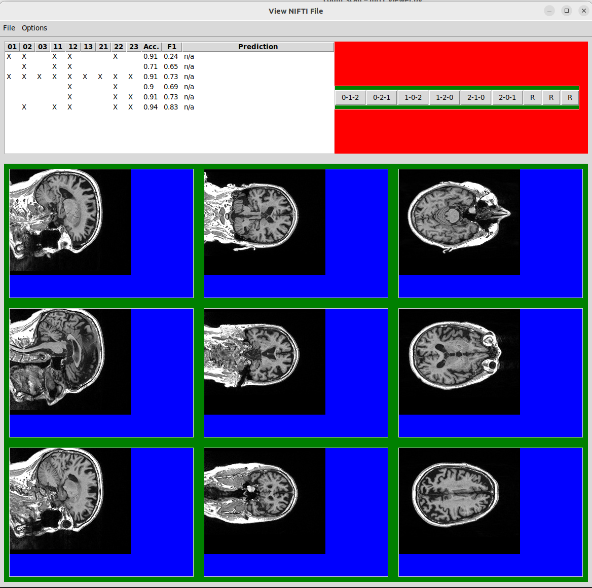
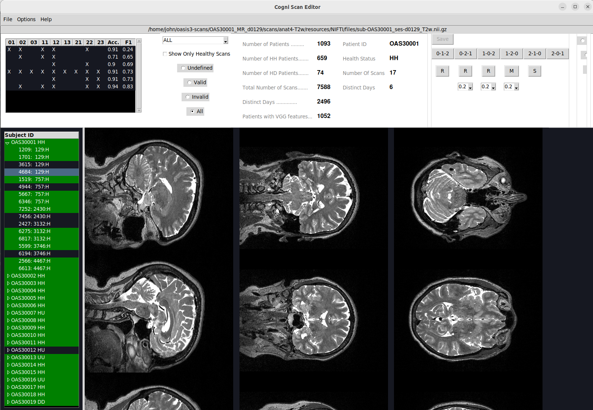
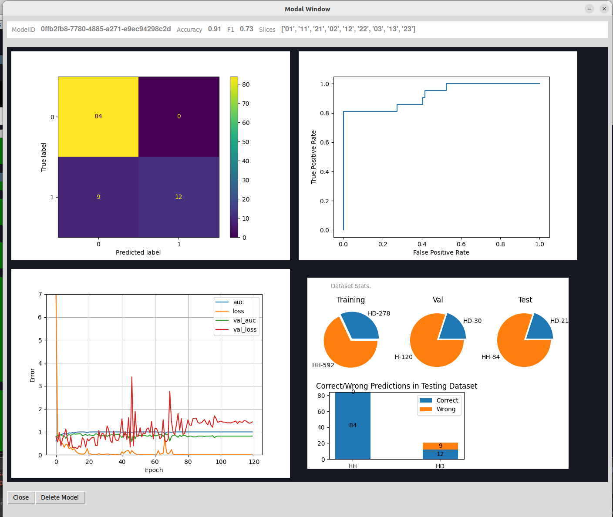
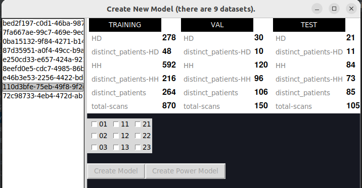

# cogni_scan

## Summary

    The objective of this project is to address the challenges associated with
    using MRI (Magnetic Resonance Imaging) data from different sources. To
    achieve this, a standardized shape needs to be established, allowing the
    utilization of MRIs regardless of their origin. This standardized shape
    requires a set of transformations to be applied to each MRI.

    Determining the appropriate transformations necessitates a manual process
    to identify the adjustments and modifications required for aligning the MRI
    data with the desired standardized format. The data collection and
    pre-processing phase aim to create a comprehensive universe of MRI source
    files, obtained from various sources, which can be processed without any
    prior knowledge of their origin.

    Currently, the models developed in this project are based on a single
    source, OASIS-3. However, extending the application of these models to
    scans from other sources poses challenges due to variations in shape and
    orientation, which impact the accuracy of the results.

    The main purpose of this project is to provide the mechanism to normalize
    the origin of each scan through manual work on each specific scan. By doing
    so, it becomes possible to utilize all available scans using the same
    algorithm. The ultimate goal is to overcome the limitations posed by
    different sources and enable the consistent analysis of MRI data for tasks
    such as model building, back-testing, and making predictions.

## Implemenation 

### Scan

    Scan is an object that holds the full path to a nifti file that uniquely
    identify an MRI and also it holds information about the necessary
    transformations to normalize it. 

    The scan object exposes and interface that allow for slicing, which will be
    used for the creation of the model (usually converting it to features like we
    are doing with VGG16).

    To keep things faster and more modular we can also pre-calculate the "features"
    while we are storing the MRI so from there we will no longer need an additional
    preprosessing step where we will be passing the Scan through the pretrained
    models but instead it will be ready to be used.

    Scan:
        full_path: The path to the nifti file that holds the MRI

        axis_mapping_id: Points to the axis mapping (assigned by the user)

        rotation_id: Points to the rotation id which should be applied (assigned by
        the user)

### Axis Mapping

    The axis mappining consists of a permuation of the first three numbers:i
    0 - 1 - 2 and represents the way that each of the three dimentions of the space
    will be used to extract a slice from an MRI.

    An MRI can be seen as a three dimentional cube but not all the MRI scans coming
    from different sources are complying to it we need to have a standarized way
    to describe them.

    The possible axis maps are stored in a separate (static) table in the data base
    which holds the three numbers plus an id.

### Rotation

    Not all slices have the same orientation, for example we can think of a
    slice where the nose is pointing left versus a slice of the same view where
    the nose is pointing upwards.

    There are three possible rotations. We will use the cv2 way of rotation:

    cv2.ROTATE_90_CLOCKWISE: Rotates the image in a clockwise direction by 90
    degrees 

    cv2.ROTATE_90_COUNTERCLOCKWISE: Rotates the image in a counter-clockwise
    direction by 90 degrees 

    cv2.ROTATE_180: Rotates the image in a clockwise direction by 180 degrees

    Rotations are stored in the database in a separate table (static) which
    will have the roation id and the corresponing cv2 name.

### Size

    Since not all MRIs are of the same size we need to use a standard size to use
    for that MRIs.

    The size is hard-coded and never changes since changing it it will require very
    expensive re-calculations of the available features. 

### Screen shots

